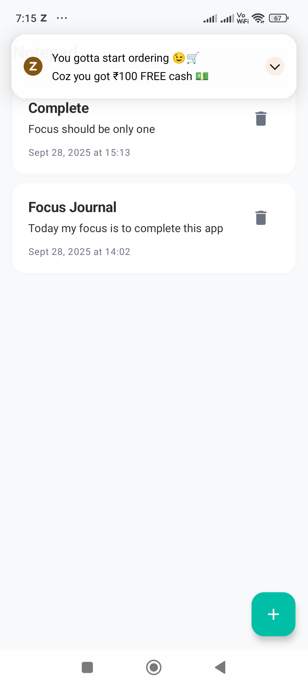
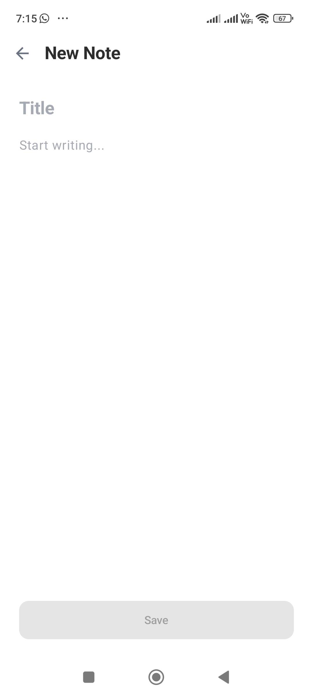
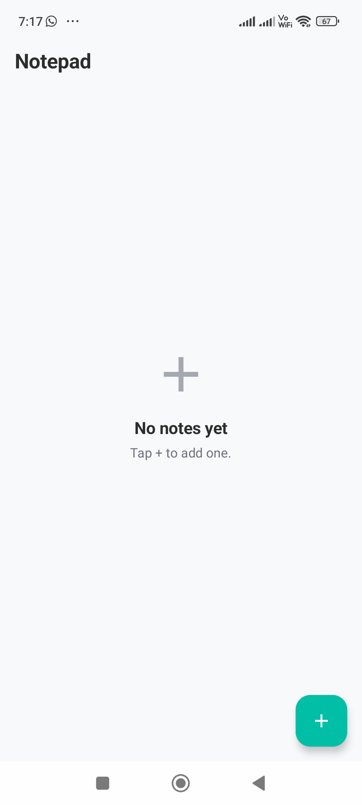

# 📝 Modern Notepad App

A beautiful, modern note-taking application built with Jetpack Compose and Room database. Features a clean, minimal design with professional typography and smooth user experience.

## ✨ Features

### 📱 Core Functionality
- **Create Notes**: Add new notes with title and content
- **Edit Notes**: Modify existing notes with real-time updates
- **Delete Notes**: Remove notes with confirmation dialog
- **Persistent Storage**: All notes saved locally using Room database
- **Real-time Updates**: Notes list updates automatically when changes are made

### 🎨 Modern UI/UX
- **Clean Design**: Minimal, professional interface
- **Card-based Layout**: Notes displayed in beautiful white cards with subtle shadows
- **Modern Typography**: Professional font hierarchy with proper weights and sizes
- **Smooth Animations**: Subtle transitions and loading states
- **Empty State**: Friendly message when no notes exist
- **Responsive Design**: Adapts to different screen sizes

### 🎯 User Experience
- **Intuitive Navigation**: Easy switching between notes list and edit screens
- **Quick Actions**: Floating action button for adding new notes
- **Confirmation Dialogs**: Safe deletion with user confirmation
- **Loading States**: Visual feedback during save operations
- **Auto-save**: Notes automatically saved with timestamps

## 🛠️ Technologies Used

### **Frontend & UI**
- **Jetpack Compose** - Modern declarative UI toolkit
- **Material Design 3** - Latest Material Design components
- **Navigation Compose** - Type-safe navigation between screens
- **Compose Material Icons** - Extended icon set for UI elements

### **Architecture & State Management**
- **MVVM Architecture** - Model-View-ViewModel pattern
- **Repository Pattern** - Data access abstraction layer
- **StateFlow** - Reactive state management
- **ViewModel** - UI state and business logic management

### **Database & Storage**
- **Room Database** - Local SQLite database with type safety
- **Kotlin Coroutines** - Asynchronous programming
- **Flow** - Reactive streams for data observation

### **Development Tools**
- **Kotlin** - Modern programming language
- **Gradle** - Build automation and dependency management
- **KAPT** - Kotlin Annotation Processing Tool for Room

## 📱 Screenshots

### Main Screen - Notes List

*Clean list of notes with modern card design and floating action button*

### Edit Note Screen

*Minimal editing interface with clean typography and save button*

### Empty State

*Friendly empty state when no notes exist*

## 🎨 Design System

### Color Palette
- **Background**: `#F8F9FA` (soft off-white)
- **Note Cards**: `#FFFFFF` (white) with subtle shadows
- **Primary Accent**: `#00BFA6` (teal) for buttons and highlights
- **Secondary Text**: `#6B7280` (cool gray)
- **Primary Text**: `#2D2D2D` (dark gray/black)

### Typography
- **App Title**: 22sp, Bold
- **Note Titles**: 18sp, Bold
- **Note Content**: 16sp, Regular
- **Note Preview**: 14sp, Regular
- **Timestamps**: 12sp, Regular (gray)
- **Button Text**: 14sp, Medium

### Visual Elements
- **Card Radius**: 16px
- **Button Radius**: 12px
- **Shadow**: 4dp elevation, 10% opacity
- **Spacing**: 12px between cards, 24px screen padding

## 🏗️ Project Structure

```
app/src/main/java/com/manish/basicnoteapp/
├── data/
│   ├── Note.kt                 # Note entity with Room annotations
│   ├── NoteDao.kt             # Data Access Object for database operations
│   ├── AppDatabase.kt         # Room database configuration
│   ├── DateConverters.kt      # Type converters for Date objects
│   └── NoteRepository.kt      # Repository for data access abstraction
├── ui/
│   ├── NoteViewModel.kt       # ViewModel for state management
│   ├── NotesListScreen.kt     # Main screen with notes list
│   ├── EditNoteScreen.kt      # Screen for creating/editing notes
│   └── Navigation.kt          # Navigation setup between screens
├── ui/theme/
│   ├── Color.kt               # Color definitions
│   ├── Type.kt                # Typography definitions
│   └── Theme.kt               # Material theme configuration
└── MainActivity.kt            # Main activity with app entry point
```

## 🚀 Getting Started

### Prerequisites
- Android Studio Arctic Fox or later
- Android SDK 24+ (Android 7.0)
- Kotlin 2.0.21+

### Installation

1. **Clone the repository**
   ```bash
   git clone https://github.com/MANDEVGOD/modern-notepad-app.git
   cd modern-notepad-app
   ```

2. **Open in Android Studio**
   - Open Android Studio
   - Select "Open an existing project"
   - Navigate to the project folder

3. **Build and Run**
   - Click "Run" button or use `Ctrl+R`
   - Select your device or emulator
   - The app will install and launch

### Building from Command Line
```bash
# Debug build
./gradlew assembleDebug

# Release build
./gradlew assembleRelease

# Run tests
./gradlew test
```

## 📖 Usage Guide

### Creating a New Note
1. Tap the **"+"** floating action button
2. Enter a title for your note
3. Write your content in the text area
4. Tap **"Save"** to store the note

### Editing an Existing Note
1. Tap on any note in the list
2. Modify the title or content
3. Tap **"Save"** to update the note

### Deleting a Note
1. Tap the **delete icon** (trash) on any note
2. Confirm deletion in the dialog
3. The note will be permanently removed

### Viewing Notes
- All notes are displayed in chronological order (newest first)
- Each note shows title, content preview, and timestamp
- Tap any note to view or edit it

## 🔧 Configuration

### Database
The app uses Room database with the following configuration:
- **Database Name**: `note_database`
- **Version**: 1
- **Table**: `notes`
- **Auto-migration**: Disabled (for simplicity)

### Theme
- **Light Theme Only**: No dark mode support
- **Dynamic Colors**: Disabled for consistent design
- **Material Design 3**: Latest design system

## 🧪 Testing

### Running Tests
```bash
# Unit tests
./gradlew test

# Instrumented tests
./gradlew connectedAndroidTest

# All tests
./gradlew check
```

### Test Coverage
- Unit tests for ViewModel logic
- Integration tests for database operations
- UI tests for user interactions

## 📦 Dependencies

### Core Dependencies
```kotlin
// Jetpack Compose
implementation("androidx.compose.ui:ui")
implementation("androidx.compose.material3:material3")
implementation("androidx.activity:activity-compose")

// Navigation
implementation("androidx.navigation:navigation-compose")

// Room Database
implementation("androidx.room:room-runtime")
kapt("androidx.room:room-compiler")

// ViewModel
implementation("androidx.lifecycle:lifecycle-viewmodel-compose")

// Coroutines
implementation("org.jetbrains.kotlinx:kotlinx-coroutines-android")
```

## 🤝 Contributing

1. Fork the repository
2. Create a feature branch (`git checkout -b feature/amazing-feature`)
3. Commit your changes (`git commit -m 'Add amazing feature'`)
4. Push to the branch (`git push origin feature/amazing-feature`)
5. Open a Pull Request

## 📄 License

This project is licensed under the MIT License - see the [LICENSE](LICENSE) file for details.

## 🙏 Acknowledgments

- **Jetpack Compose** team for the amazing UI toolkit
- **Material Design** team for the design system
- **Android Developers** community for best practices
- **Room** team for the excellent database solution

## 📞 Support

If you have any questions or need help:

- **Issues**: [GitHub Issues](https://github.com/MANDEVGOD/modern-notepad-app/issues)
- **Discussions**: [GitHub Discussions](https://github.com/MANDEVGOD/modern-notepad-app/discussions)
- **Email**: your.email@example.com

## 🔮 Future Enhancements

- [ ] Dark theme support
- [ ] Note categories/tags
- [ ] Search functionality
- [ ] Note sharing
- [ ] Cloud sync
- [ ] Rich text formatting
- [ ] Note templates
- [ ] Export to PDF
- [ ] Widget support
- [ ] Backup/restore

---

**Made with ❤️ using Jetpack Compose and Material Design 3**
